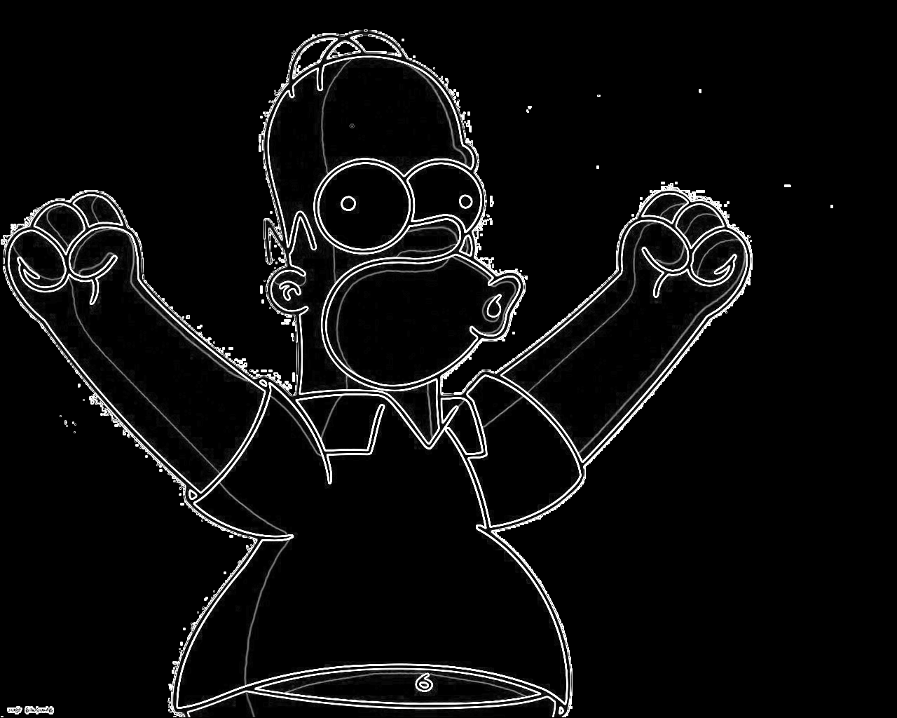

# Tarea 1
La primera tarea consiste en realizar el programa secuencial para ello hay que copiar el fichero [fuente](../../results/task1/src/serie.cpp). El código tiene una serie de comentarios marcados con la palabra "TODO" o "YOUR CODE" donde
deberás ir añadiendo el código correspondiente que creas para obtener el programa secuencial correcto.

Responde a las siguientes preguntas:

## ¿Cuál es el propósito de los include stb?
En este caso la librerías que se utilizan son la de `stb/stb_image.h` y `stb/stb_image_write.h` que se utilizan para procesar las imágenes.

Por ejemplo, se utiliza la función `stbi_load` para cargar la imagen en un puntero `unsigned char` y `stbi_image_free` para liberar espacio de memeria. Y la función `stbi_write_png` para escribir los bytes que forman la imagen en un archivo.

## ¿Qué se diferentes técnicas hay para solventar el problema de los píxeles de la parte más: alta, baja, izquierda, derecha de la imagen?
Una opción que se puede hacer es la que se lleva acabo en este caso, que es la de ignorar los píxeles que se encuentren en los extremos.

Otra opción que hemos visto en el siguiente [recurso](https://stackoverflow.com/questions/64410442/cs50-pset4-sobel-filter-edges-border-pixels), lo que hace es que para aquellos píxeles que se encuentran fuera de la imagen se consideran iguales a cero.

## Modifica el código para que acepte la imagen por línea de comandos y si no se proporciona utilice el nombre "borders.png"
**Guarda el código en results/task1/task1_b.cpp**. 
A partir de ahora usa ese fichero como base para las siguientes modificaciones.

## Ejecuta el código con todas las imágenes de la carpeta "images".
**Guarda el resultado del algoritmo en results/task1/images/{nombre_original-borders.png} y añádelas a continuación
de modo que se vean en github. Añade también el tiempo medio que has tardado en obtener la salida.**

|  Imagen                                                                |   Tiempo (s)    |
|:----------------------------------------------------------------------:|:---------------:|
|    [homer-borders.png](../../results/task1/images/homer-borders.png)   |   0.0312922     |
|  [paisaje-borders.png](../../results/task1/images/paisaje-borders.png) |   0.103196      |
|    [puente-borders.jpg](../../results/task1/images/puente-borders.png) |    0.20646      |

## HOMER:

## PAISAJE

## PUENTE
